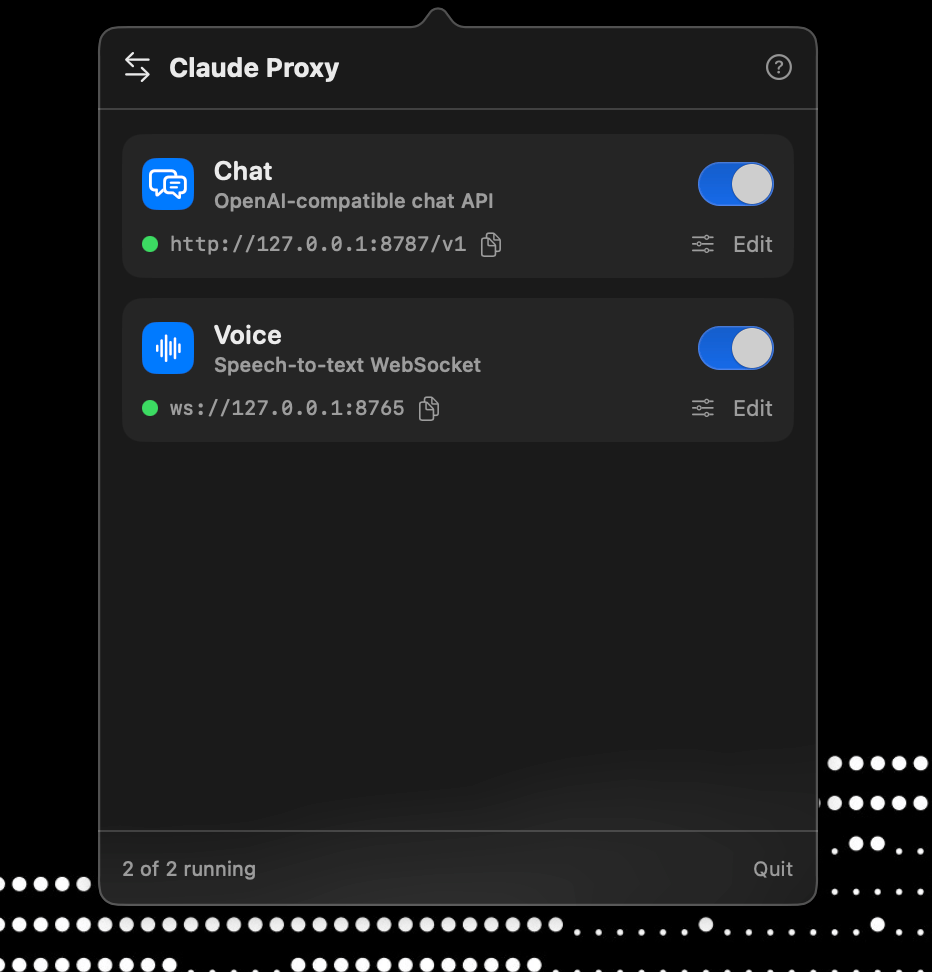

# claude-proxy

**One subscription. AI in every app.**

A simple menu-bar-only macOS app that exposes an OpenAI-compatible endpoint to
your Claude Code subscription.

<p align="center">
  
</p>

`claude-proxy` turns your Claude Code subscription into a local, OpenAI-compatible
API. You run it once, and it gives you a URL like `http://127.0.0.1:8787/v1`.
Paste that URL into any app that lets you point at a custom OpenAI endpoint — and
that app now has AI, powered by the subscription you already pay for.

No separate per-app AI plan. No extra tokens to buy. The apps you already use just
start talking to the model through your one subscription.

Add as many endpoints as you want — one per port, each backed by whatever Claude
model you choose.

---

## How it works

Each "instance" runs a small local HTTP server that speaks the OpenAI
`/v1/chat/completions` (and `/v1/models`) protocol. When a request comes in, it
drives the headless `claude` CLI (`claude -p --output-format stream-json`) and
streams the response back in OpenAI's format. Tool use is disabled and the system
prompt is overridden, so responses behave like a plain chat model.

```
your app  ──HTTP──▶  claude-proxy (localhost:8787)  ──▶  claude CLI  ──▶  your subscription
        ◀──OpenAI JSON / SSE──
```

## Requirements

- macOS 14 or later
- [Claude Code](https://claude.com/claude-code) installed and logged in
  (`claude` must be on your login shell's `PATH`)
- Swift 6 toolchain (Xcode command-line tools) to build

## Install

Grab the latest `Claude-Proxy-<version>.zip` from the
[Releases](https://github.com/zeus-12/claude-proxy/releases) page, unzip it, and
move **Claude Proxy.app** to `/Applications`.

The app isn't code-signed (that needs a paid Apple Developer account), so the
first time you open it macOS Gatekeeper will complain. Either **right-click the
app → Open** and confirm, or clear the quarantine flag once:

```bash
xattr -dr com.apple.quarantine "/Applications/Claude Proxy.app"
```

Then launch it — it lives in the menu bar, not the Dock.

## Build & run (from source)

```bash
swift build -c release
./.build/release/ClaudeProxy &
```

Or for development:

```bash
swift run
```

It launches as a **menu-bar app** — no Dock icon, no window. Click the icon in the
menu bar to add, start, stop, and edit instances. The first instance defaults to
model `sonnet` on port `8787`.

To stop it: `pkill -f ClaudeProxy`.

## Point an app at it

In any OpenAI-compatible client (chat apps, editors, SDKs):

| Field        | Value                          |
| ------------ | ------------------------------ |
| Base URL     | `http://127.0.0.1:8787/v1`     |
| API key      | any non-empty string (ignored) |
| Model        | `sonnet` (or your instance's model) |

### Try it with curl

Non-streaming:

```bash
curl http://127.0.0.1:8787/v1/chat/completions \
  -H 'Content-Type: application/json' \
  -d '{
    "model": "sonnet",
    "messages": [{"role": "user", "content": "Give me three names for a coffee shop."}]
  }'
```

Streaming (SSE):

```bash
curl -N http://127.0.0.1:8787/v1/chat/completions \
  -H 'Content-Type: application/json' \
  -d '{
    "model": "sonnet",
    "stream": true,
    "messages": [{"role": "user", "content": "Count from 1 to 5."}]
  }'
```

## Using it beyond your Mac

The server binds to `127.0.0.1` only. To reach it from another device or a hosted
app, run a local tunnel — it runs on your Mac and forwards to the port:

```bash
ngrok http 8787
# or
cloudflared tunnel --url http://127.0.0.1:8787
```

## Honest caveats

- **Terms of service.** This routes a Claude Code subscription through a
  general-purpose API endpoint. That's in tension with Anthropic's terms, which
  license the subscription for use *through* their client — not as a redistributable
  gateway. Use it for yourself, at your own risk.
- **It's an agent, not the raw API.** Output comes from the Claude Code agent with
  its baseline context, so it isn't byte-for-byte identical to the Anthropic API.
- **Per-request token floor.** Each request carries ~12k tokens of baseline context,
  which counts against your subscription's usage limits. Short replies still cost
  that floor.

## Development notes

- Pure SwiftUI / AppKit / Network / Foundation — no external dependencies.
- If runtime behavior ever contradicts your source edits, do a clean build:
  `rm -rf .build && swift build`. Incremental builds occasionally don't relink.
